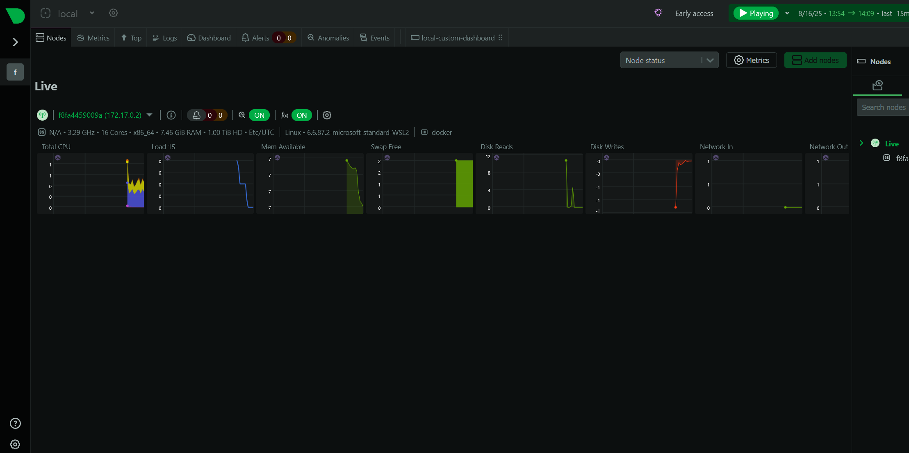
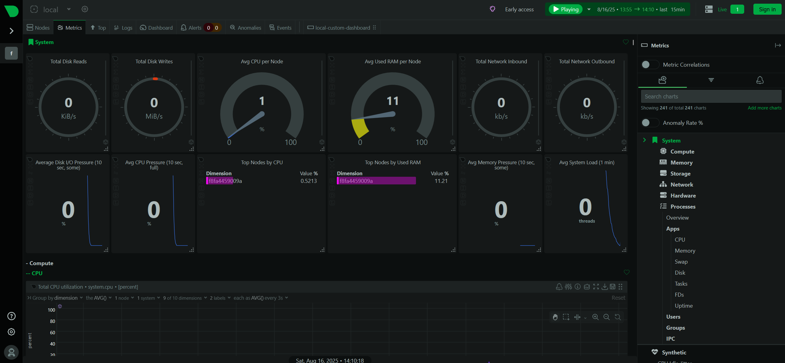
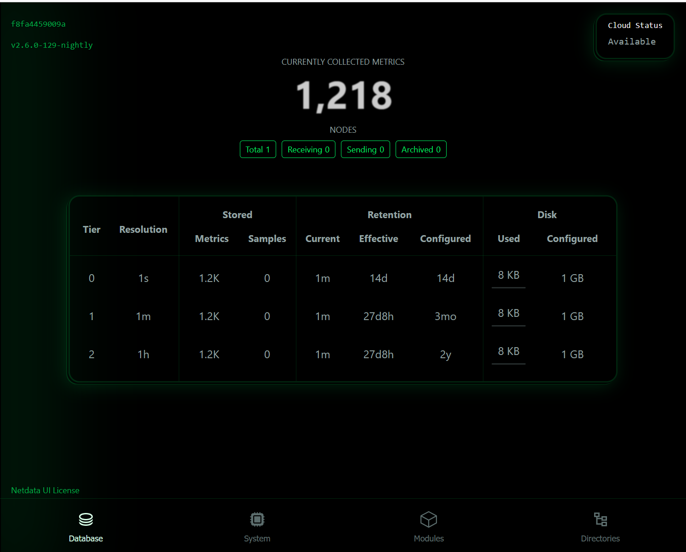
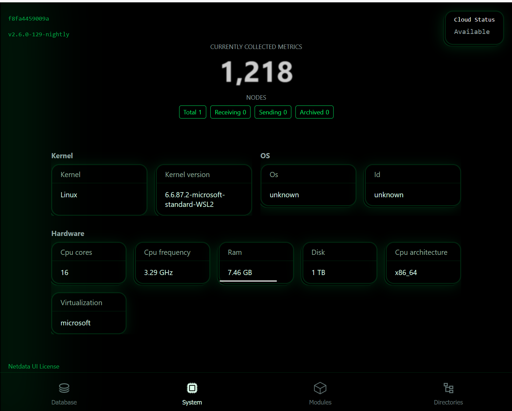

# TASK 7: Monitor System Resources Using Netdata

## Steps

1. Run Netdata using Docker
   ```bash
   docker run -d --name=netdata \
     -p 19999:19999 \
     --cap-add SYS_PTRACE \
     --security-opt apparmor=unconfined \
     netdata/netdata

2. Verify container is running

    docker ps

3. Open Netdata Dashboard in browser

    http://localhost:19999

4. Explore metrics:

    CPU usage

    Memory usage

    Disk I/O

    Docker containers

5. Check alerts and charts on the dashboard

6. View logs

    docker logs netdata

## Screenshots

📸 Netdata Dashboard  



📸 CPU and Memory Metrics  

